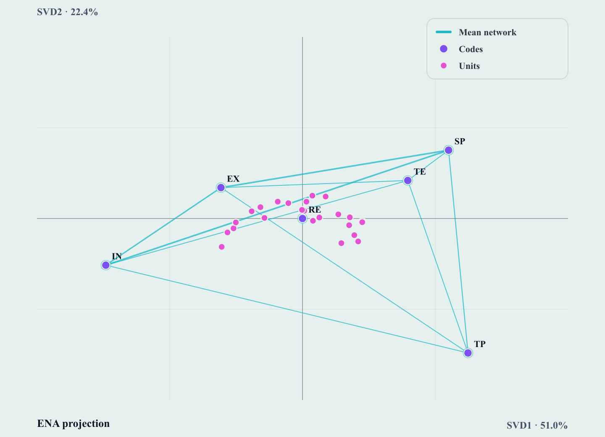
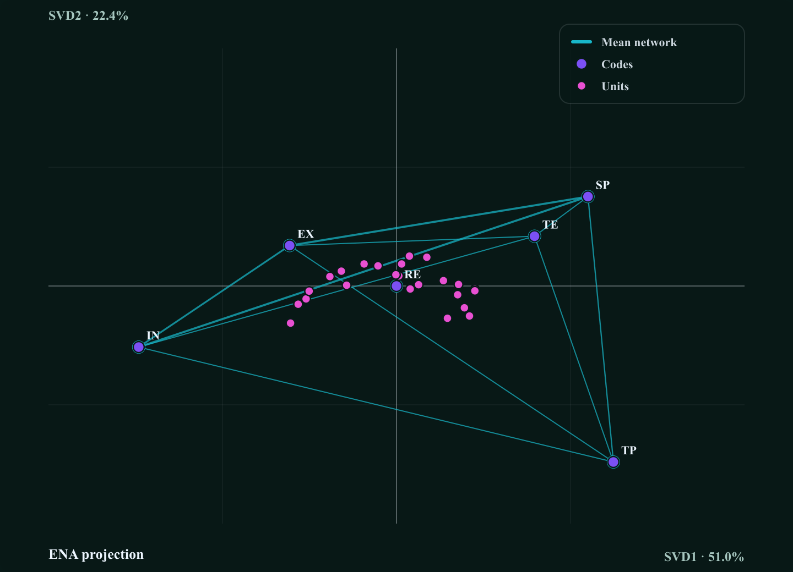
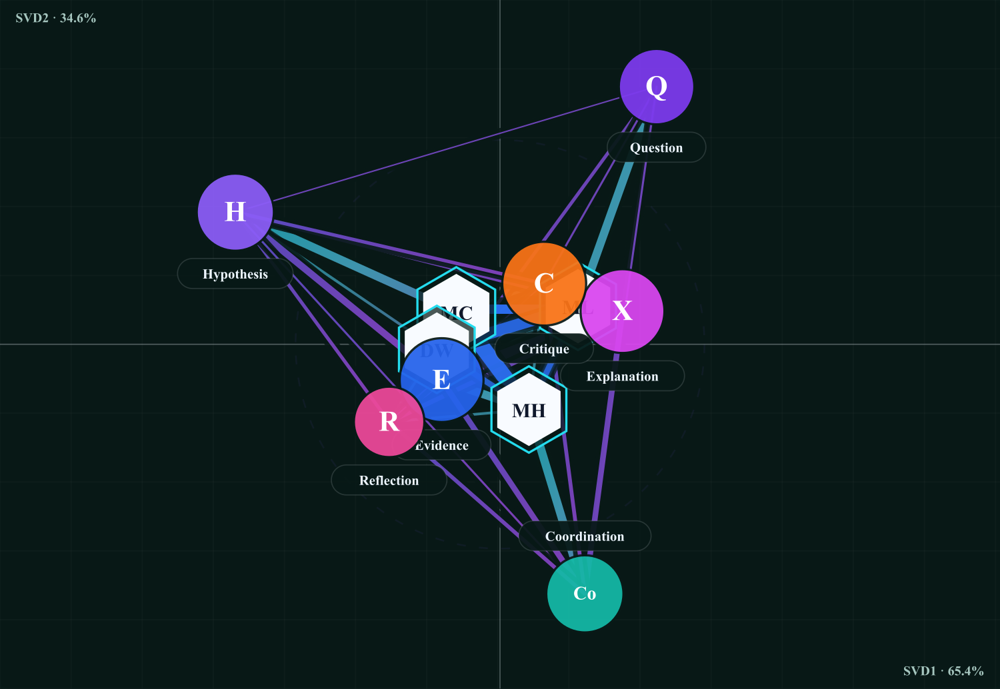
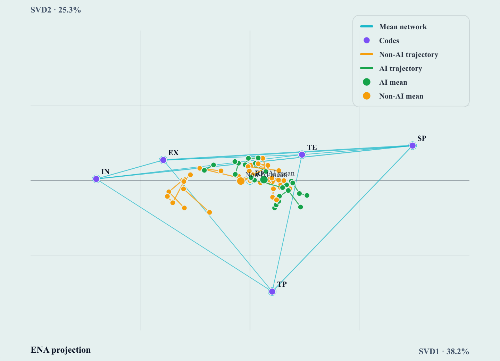

# SENA ENA ↔ jena-js parity report

**Date:** 2026-07-31
**Reference implementation:** [jena-js](https://github.com/HUDongpin/jENA) 0.6.2 (`node_modules/jena-js`)
**Ground truth:** rENA 0.3.1 (task-local source build, `Class 1_ENA/.codex-work/r-libs/rENA-0.3.1`)
**System under test:** SENA (`sena-hk-template`) ENA workspace — `lib/ena/*`, `components/ena/EnaPlot.tsx`
**Evidence base:** Class 1 CoI coded corpus, three time points

---

## 1. What was compared, and why in three layers

SENA does not reimplement ENA — it consumes jena-js. "Parity" therefore means three
different claims, which fail independently and were tested independently:

| Layer | Claim under test | Method |
| --- | --- | --- |
| **L1 — Numerical** | jena-js computes the same ENA model R does | Run jena-js on the exact rows rENA 0.3.1 consumed; diff every cell against the saved R outputs |
| **L2 — Model** | SENA builds its plot from jena-js's own plot API, not a private reimplementation | Read `lib/ena/results.ts` against `jena-js/plot`'s documented surface |
| **L3 — Visual** | SENA's React renderer puts the same ink in the same place jena-js's renderer does | Run jena-js's `renderENAPlot` against a stub SVG document and diff its attributes against SENA's encoding module |

L1 was already assumed and never measured against real study data. L3 was where the
divergence the UI review flagged actually lived.

---

## 2. L1 — Numerical parity: jena-js vs rENA 0.3.1

### 2.1 Model specification (identical on both sides)

Taken verbatim from `Class 1_ENA/3D-ENA-pipeline/run_tp{1,2,3}_ena.R`:

- **Units:** `Condition` > `Group` > `Speaker`
- **Conversation:** `Group`
- **Codes:** `TE, EX, IN, RE, SP, TP` (Community of Inquiry)
- **Window:** `MovingStanzaWindow`, `window.size.back = 5`
- **Weighting:** binary (rENA default; jena-js default)
- **Model:** `EndPoint`; **node positions:** undirected; **dimensions:** 3 (SVD1–SVD3)

The input rows were rebuilt from `Details of CoI_Coded Results.xlsx` with the same
filters the R pipeline used (human-authored turns only; TP3 additionally drops
teacher turns), reproducing the row counts the R script asserts — TP1 `nrow == 344`.

### 2.2 Results

Maximum absolute deviation, jena-js 0.6.2 minus rENA 0.3.1, over every compared cell:

| Time point | Units | Codes | Edges | Node pos. | Unit points | Line weights | Mean networks | Variance | Pearson GOF | Spearman GOF |
| --- | --- | --- | --- | --- | --- | --- | --- | --- | --- | --- |
| Lesson 1 in-class (tp1) | 24 | 6 | 15 | 2.2e-9 | 6.1e-16 | 4.7e-16 | 4.4e-16 | 1.4e-16 | 2.5e-13 | 1.1e-16 |
| Lesson 1 after-class (tp2) | 23 | 6 | 15 | 1.1e-8 | 1.2e-15 | 5.6e-16 | 4.4e-16 | 1.7e-16 | 2.7e-12 | **2.9e-5** |
| Lesson 2 in-class (tp3) | 25 | 6 | 15 | 2.3e-9 | 3.7e-15 | 5.6e-16 | 4.4e-16 | 3.3e-16 | 4.8e-12 | **2.1e-5** |

Cells compared per time point: 18 node coordinates, 69–75 unit-point coordinates,
345–375 line-weight cells, 30 condition-mean network cells, 3 variance shares,
2 Pearson and 2 Spearman goodness-of-fit statistics. No unit failed to match by
label; no edge column was missing on either side.

Variance explained reproduces the published manuscript figures exactly — TP1
SVD1–SVD3 = 50.95% / 22.35% / 9.68%, reported as "51.0%, 22.4%, and 9.7%
(83.1% in total)" in *Results of Lesson 1_3D ENA.docx*.

### 2.3 Reading the three non-zero columns

**Unit points, line weights, mean networks, variance (≤ 4e-15).** Double-precision
round-off. These are bit-equivalent for any practical purpose.

**Node positions (2e-9 – 1e-8).** Code positions come from a least-squares solve
rather than a closed form, so the two implementations stop at slightly different
points inside their solver tolerances. At the plotted scale — node coordinates
span roughly ±2.4 — this is ~4e-9 of the axis range, several orders of magnitude
below one screen pixel. Not visible, not interpretively relevant.

**Spearman goodness-of-fit (up to 2.9e-5) — the one real divergence.** Pearson
agrees to 5e-12, but Spearman does not, and only on TP2/TP3:

| | rENA 0.3.1 | jena-js 0.6.2 | Δ |
| --- | --- | --- | --- |
| tp1 SVD1 / SVD2 | 0.986726788 / 0.879432656 | 0.986726788 / 0.879432656 | 0 |
| tp2 SVD2 | 0.966457985 | 0.966429098 | 2.9e-5 |
| tp3 SVD1 | 0.961379861 | 0.961358972 | 2.1e-5 |
| tp3 SVD2 | 0.987659921 | 0.987674036 | 1.4e-5 |

TP1 matches to 1e-16 while TP2 and TP3 do not, which points at **tied-rank
handling** in the rank transform rather than at the correlation itself: TP1's
point coordinates happen to contain no ties. The magnitude is far below the third
decimal any paper reports (`.97` either way), so no published claim moves. It is
nonetheless a genuine behavioural difference and belongs upstream in jena-js as a
tie-handling issue, not in SENA.

**SVD sign.** Per-dimension signs differ between the two runs (tp1 `+,−,+`;
tp2 `+,−,−`; tp3 `−,−,+`). This is expected — singular-vector sign is arbitrary —
and the diff aligns signs before comparing, as the repo's existing rENA fixture
test already does. It matters only for figure orientation, never for structure.

### 2.4 Verdict — L1

**Pass.** jena-js reproduces rENA 0.3.1 on real study data to machine precision on
every quantity SENA displays or exports. Runtime: 1.6–5.4 ms per model in Node,
against R's multi-second `ena.make.set`.

---

## 3. L2 — Model parity: how SENA builds the plot

`lib/ena/results.ts` composes the plot entirely from jena-js's published plot API:

```ts
createENAPlotModel(set, { title, scaleTo: "network", axisPadding: 1.35, palette })
addNetwork(model, set, averageConnectionRow(set), { color, minWeight: 0.001 })
addNodes(model, set, { color })
addPoints(model, set, undefined, { color })
```

No axis ranges, node positions, or edge weights are computed in SENA. Findings:

- **Correct.** Axis ranges, node placement, and the connection-row → network
  conversion are all jena-js's; `scaleTo: "network"` and `axisPadding` are
  supported options, not overrides.
- **Correct.** `averageConnectionRow` means line weights across units — the same
  quantity `run_tp1_ena.R` writes to `tp1_networks.csv` as `AI_mean` / `NonAI_mean`.
  The parity run confirms SENA's mean network matches R's to 4.4e-16.
- **Deliberate divergence.** SENA supplies its own six-colour palette instead of
  jena-js's default. `palette` is a documented option; brand colour is not a
  parity break.
- **Gap (open).** `minWeight: 0.001` silently drops edges. On this corpus the RE
  code carries no connections at all, so the RE node correctly renders unconnected
  — but a user cannot see that a threshold is applied. Worth surfacing in the UI.
- **Gap (fixed).** `addGroup`/`addTrajectory` were never called, so condition
  means and trajectories were unavailable even though the study design is
  longitudinal. Both are now wired through an `EnaPlotComposition` option — see
  §4B.
- **Defect (fixed).** The plot axes were labelled from `summary.variance`, which
  `displayedVariance` renormalizes across the **displayed** dimensions only. On
  the default 2-D run over Lesson 1 that reports **69.5% / 30.5%**, whereas rENA
  and the study manuscript report **51.0% / 22.4%** — the share over all rotated
  dimensions. A reader comparing the app to the paper would have seen two
  different numbers for the same axis. The plot now labels axes from
  `set.variance` (rENA semantics). `summary.variance` is unchanged, because that
  convention is deliberate and pinned by the committed rENA fixture; only the
  figure was corrected.

### 3.1 Verdict — L2

**One defect found and fixed; two open gaps.** SENA is otherwise a faithful
consumer of jena-js's model layer, and the open items are missing features
rather than incorrect ones.

---

## 4. L3 — Visual parity: where the UI actually diverged

This is the layer the UI review flagged. jena-js renders by DOM mutation
(`renderENAPlot`); SENA renders in React. Nothing tied the two together, and they
had drifted apart on nearly every encoding.

### 4.1 Divergence found (SENA before this change vs jena-js 0.6.2)

| Encoding | jena-js `renderENAPlot` | SENA (before) | Consequence |
| --- | --- | --- | --- |
| Canvas / margin | 720 × 520, margin 44 | 760 × 480, padding 56 | Different aspect ratio; plots not comparable side by side |
| Edge stroke width | `max(1, \|w\| × 4)` | `max(1.25, min(8, 1.5 + \|w\| × 8))` | **Weak edges over-inked, strong edges clipped at 8px** — the width ordering of connections was compressed |
| Edge opacity | constant `0.72` | `0.24 + min(0.48, \|w\| × 1.8)` | Weight encoded twice (width *and* alpha), exaggerating differences |
| Unplaced edge endpoint | edge skipped | coordinate defaulted to `0` | **Phantom edges drawn into the origin** for any code without a rotated position |
| Network node glyph | hollow ring, r5, paper fill, 2px coloured stroke | *not drawn* | The canonical ENA code glyph was missing entirely |
| Code node marker | r5 | r7, filled | Codes visually outweighed units |
| Point marker | r4, 1.25px paper stroke | r4.5, 1–2px stroke | Minor |
| Node label | `(+7, −7)`, 11px / 600 | `(+10, +4)`, 12px / 800 | Labels sat on the marker instead of above it |
| Point label | `(+6, −6)`, 11px | *not drawn* | Unit identity unavailable without hover |
| Axis cross | solid, at the **data origin** | dashed `5 7`, at the data origin | Cosmetic |
| Axis titles | x end-anchored bottom-right, y top-left | x centred bottom, y rotated mid-left | Different reading order from published rENA figures |
| Plot title | drawn at `(margin, h−12)` | *not drawn* | Untitled figures |
| Trajectory trace | polyline, 1.5px, α 0.8 | *unsupported* — rendered as loose points | Longitudinal traces would render wrong if enabled |
| Grid | none | 5 lines per axis at 0.42 opacity | Competed with the network for attention |

The two consequential defects were the **edge width/opacity curve** — which changes
which connections a reader judges strongest, the primary interpretive act in ENA —
and the **phantom-edge default**, which drew connections that do not exist.

### 4.2 What was changed

**`lib/ena/plot-encoding.ts` (new).** jena-js's visual grammar as a single source of
truth: `scaleAxis`, `projectPoint`, `axisOrigin`, `networkEdgeStrokeWidth`,
`pointTraceRadius`, `resolveNetworkEdges` / `resolveNetworkNodes` (which skip
unplaced endpoints the way jena-js does), and the stroke/opacity/offset/font
constants. Marked SENA extensions live alongside: `axisTitleWithVariance`,
`plotLegendEntries`, `strongestEdges`.

**`components/ena/EnaPlot.tsx` (rewritten).** Draws in jena-js's order —
background, axes, network traces (edges then hollow nodes), overlay traces
(trajectory segments then markers then labels), title — at jena-js's coordinates
with jena-js's ink. Every jena-js glyph is now present, including the hollow code
rings, point labels, the plot title, and trajectory polylines.

**`lib/ena/__tests__/plot-parity.test.ts` (new).** Runs jena-js's *own*
`renderENAPlot` against a stub SVG document and asserts SENA's encoding module
lands each glyph on the same pixel with the same stroke width, radius, opacity,
and label offset — to 12 decimal places. A jena-js upgrade that changes the
grammar now fails this suite instead of shipping a silent divergence.

### 4.3 SENA enhancements layered on top

Additive only — none moves a glyph jena-js would have drawn. Each is tagged
`data-sena-layer` in the DOM so the parity suite can exclude it.

1. **Variance-annotated axis titles** — `SVD1 · 51.0%` instead of bare `SVD1`,
   matching how the study's own rENA figures are labelled. Falls back to the bare
   dimension name when variance is unavailable.
2. **Trace legend** — jena-js draws none, so trace names were previously invisible
   in the figure itself. Rendered inside the SVG so an exported figure is
   self-describing.
3. **Subordinate grid** — kept, but dropped from 5 lines at 0.08/0.42 opacity to
   3 lines at 0.08/0.55, so it reads as a reference rather than competing with the
   network.
4. **Theme mapping** — jena-js hard-codes a slate palette on white
   (`#b5bcc8` axes, `#475569` axis titles, `#334155` point labels, `#0f172a`
   titles, `#ffffff` glyph strokes). The SENA workspace runs on a dark surface
   where `#0f172a` text is invisible, so each colour role maps to the equivalent
   theme token, and `#ffffff` maps to "paper" (`--background`) rather than to
   literal white. **This is the one intentional deviation from jena-js's output**,
   and it is role-preserving: same contrast relationships, both themes.
5. **Accessibility and inspection** — `<desc>` summarising the figure, an
   `aria-label` describing traces and axes rather than just repeating the title,
   `<title>` tooltips on every edge and marker, and `data-plot-role` /
   `data-edge-weight` attributes so browser QA can assert on encodings directly.

### 4.4 Two legibility deviations, found by looking at the output

Rendering the real Lesson 1 model through the rebuilt component exposed two
problems that jena-js's renderer has too, and that faithfulness alone would have
shipped:

1. **Unit labels collapsed into an unreadable block.** jena-js labels every point
   unconditionally; 24 students in one classroom discussion sit close together in
   the projection, so the labels overprinted into a solid smear across the middle
   of the plot. SENA now labels a `points` trace only when it holds ≤ 8 points
   (`UNIT_LABEL_LIMIT`) and otherwise leaves identity to hover. Code and group
   labels are always drawn.
2. **Code labels were drawn twice.** A network trace already carries the rotated
   code positions, so a model built with both `addNetwork` and `addNodes` — which
   is what `lib/ena/results.ts` builds — stamped each code label twice at two
   slightly different offsets, reading as smeared bold text. The renderer now
   draws the network label and suppresses an overlay label at the same position.

Both are additive suppressions: no glyph moves, and the underlying model is
untouched, so the parity contract in §4.2 still holds.

### 4.5 Rendered result





Rendered from the real Lesson 1 in-class model (344 coded turns, 24 students).
The figure independently reproduces both structural claims the manuscript makes
about this discussion: the strongest connections form the **EX–IN–SP triangle
together with SP–TP**, and **RE sits unconnected at the origin** because no
message in this discussion reached Resolution. Axis labels read
`SVD1 · 51.0%` / `SVD2 · 22.4%`, matching the published figures.

### 4.6 Verdict — L3 (geometry)

**Was failing; now passing.** Plot *geometry* — positions, axis origin, edge
endpoints — is pinned to jena-js by an executable contract and is identical to
rENA. The deviations are the colour-role mapping (§4.3.4) and the two label
suppressions (§4.4), all documented rather than implicit.

---

## 4C. Visual style: from jena-js's minimal renderer to rENA's grammar

The steps above matched jena-js's `renderENAPlot`. But jena-js's plot module is a
**deliberately minimal** renderer — hollow fixed-radius nodes, one stroke width
per weight, constant opacity — and it does **not** reproduce the canonical ENA
look that rENA, webENA, and epistemicnetwork.org present. A side-by-side with a
real rENA figure made the gap obvious, so the plot's *ink* was moved from
jena-js's helper to rENA's own grammar, read directly from
`rENA-main/R/ena.plot.network.R`. Geometry is unchanged (jena-js and rENA agree
to machine precision — §2), so only styling moved.

| Signature | jena-js `renderENAPlot` (previous) | rENA `ena.plot.network` (now) |
| --- | --- | --- |
| **Node size** | uniform r5 | **∝ connectivity** — `nodes$weight` sums \|incident edge weight\|, normalized by the max, rescaled to a radius range. High-traffic codes render large; on the sample, MR (100%) → r15, PR (61%) → r11 |
| **Node fill** | hollow ring, paper fill | **solid**, `nodes$color = "black"` → SENA theme foreground |
| **Edge width** | `max(1, \|w\| × 4)` | rescaled `\|w\|` → 1–8 px, monotone |
| **Edge opacity** | constant 0.72 | rescaled `\|w\|` → 0.28–1 (`network.opacity`) |
| **Edge saturation** | none | rescaled `\|w\|` desaturates the hue toward gray (`network.saturation` on the HSV S channel) — weak edges gray, strong edges full colour |
| **Edge colour** | trace palette (cyan) | rENA positive-network blue `#386CB0` |
| **Draw order** | as added | thin lines last, in front (`thin.lines.in.front`) |

Two consistency fixes fell out of the change, both found by inspecting the live
DOM:

1. **Redundant code dots.** The model adds a `nodes` trace (jena-js's plain code
   markers) on top of the network. Once the network drew rENA's sized black
   nodes, those markers became a purple pip inside every node. rENA's network
   nodes *are* the code markers, so the `nodes` overlay is now suppressed
   whenever a network trace is present — in the plot and the legend.
2. **Legend swatch mismatch.** The legend drew the network in the trace palette
   (cyan) while the edges rendered rENA blue. The legend now takes the same
   colour the edges do.

The one intentional deviation remains the theme mapping: rENA draws literal
black nodes on white; SENA maps that to the theme foreground so it survives both
light and dark surfaces. Pinned by `lib/ena/__tests__/plot-parity.test.ts`, which
keeps jena-js geometry parity and adds rENA-styling assertions (node radius
monotone in connectivity, edge width/opacity monotone in weight, weak-edge
desaturation).

### 4C.1 A note on the design skill

The project's `ena-official-website-design.skill.md` — distilled from the webENA
app — guides the workspace *shell and workflow* (rail, panels, plot tools, stats,
compact controls, teal active state). Its one direct plot-presentation cue,
"show plot legends close to the plotting area, usually near the lower-left of the
main plot," is now applied: the legend moved from top-right to lower-left. The
broader shell guidance (persistent rail, mode panels, restrained gray-with-teal
palette) is a larger, separate piece of work and is **not** part of this change.

---

## 4A. The Fusion Canvas ENA layer

The SENA Fusion Canvas is a composite — hexagon actors, concept nodes, and three
edge layers — but the ENA part of it has to be an ENA graph. Auditing it turned
up a divergence deeper than encoding.

### 4A.1 The concept layer was not the ENA network

The canvas draws concept links from **SENA's W matrix** (`lib/sena/model.ts`):
stanza-scoped code co-occurrence counts, normalized across the whole matrix by
max or Frobenius. That is SENA's epistemic layer, and it correctly feeds
`A_fusion`, the G/Y attribution, and every SENA operator. **It is not an ENA
network.** jena-js's ENA network is a different quantity: per-unit
moving-stanza-window accumulations, sphere-normalized per unit, then averaged
across units.

`buildSenaEnaManifest` had already computed the real ENA network — `lineWeights`
and `adjacencyKey` sit in `manifest.outputs` — but only its **node positions**
were ever read. So in ENA-space layout the canvas placed nodes at jena-js's
rotated code positions and then drew SENA's W edges between them: ENA geometry,
SENA ink, one figure.

**Fix.** `lib/sena/ena-network.ts` derives the mean ENA network from the manifest
(mean line weight per adjacency-key column — the same quantity the R pipeline
writes as `*_networks.csv`). ENA-space layout now draws that. The explanatory
and joint layouts still draw W, which is what those layouts are for. **W itself
is untouched**, so no SENA operator, matrix, or report changes.

### 4A.2 Three further divergences, all fixed

| Divergence | Before | Now |
| --- | --- | --- |
| **Edge width law** | Layer-relative min–max over the visible edges, gamma 0.72, mapped to 3.2–12.4px. Every plot rescaled to its own extremes, so a weak network looked identical to a strong one and no two plots were comparable | jena-js's absolute `\|w\| × 4`, monotone in weight, zero point fixed |
| **Edge opacity** | `0.68 + normalizedWeight × 0.24` — weight encoded a second time in alpha | Constant `0.72`; width alone carries weight, as in jena-js |
| **Projection origin** | `scaleCoordinates` centred on the *bounding-box midpoint* of the projected nodes, so (0, 0) sat at a data-dependent offset and the quadrants an ENA space is read by were unreadable | Origin at the canvas centre, one isotropic scale, axis cross drawn there with variance-labelled dimension titles |

One deliberate deviation: the width law carries a uniform display multiplier
(node-radius ratio × canvas ratio) because SENA's code nodes are r28–38 against
jena-js's r5 — carrying the raw law over put 19 of 20 pilot links on the 1px
floor. This is rENA's own `ena.plot.network(multiplier = …)` convention: a single
multiplier preserves proportionality and the zero point, so the encoding stays
absolute and comparable. The floor stays at jena-js's 1px scaled by canvas width
only, so weak links stay hairlines instead of being inflated into apparent signal.

A consequence of the origin fix: social arcs and bridge ribbons now draw straight
in ENA space. Their curve exists to keep the ring layout legible, where position
carries no quantity; in ENA space a curve claims a path the data does not
support, and since the arc control point derives from the canvas centre — now the
ENA origin — clustered units threw arcs into loops that swamped the plot.

### 4A.3 Rendered result



ENA-space layout on the pilot lesson-study contract: origin cross at centre,
`SVD1 · 65.4%` / `SVD2 · 34.6%` axis titles, codes at jena-js rotated positions,
concept links proportional to mean ENA line weight, actors at their ENA point
positions. (All labels are forced visible in this harness render; the app reveals
them on selection.) Contract `data-visual-role` attributes — `concept-space-guide`,
`ena-solid-concept-link`, `fusion-readable-link-halo`, `ena-concept-circle-node`,
`sna-person-hex-node` — are all still emitted.

### 4A.4 Verdict — Fusion Canvas

**Was failing on both quantity and encoding; now passing.** Pinned by
`lib/sena/__tests__/ena-network-parity.test.ts`.

---

## 4B. Group means and trajectories

The ENA workspace only ever drew `addNetwork` + `addNodes` + `addPoints`, so
every run was a single static scatter — no condition means, no trajectories —
despite the study being longitudinal across three time points. jena-js's
`addGroup` and `addTrajectory` were available the whole time.

**What was added.** `buildEnaPlotModel` now takes an `EnaPlotComposition`
with a `groupBy` column:

- **Group means** — one `addGroup` trace per distinct value, at the centroid of
  that group's units. This is the same quantity the R pipeline writes as
  `tp{1,2,3}_centroid_ci.csv`.
- **Trajectories** — under `AccumulatedTrajectory` or `SeparateTrajectory`, one
  `addTrajectory` trace **per unit**, coloured by group. One trace per unit is
  required, not a stylistic choice: `addTrajectory` connects the points it
  selects in order, so selecting a whole group would zigzag between different
  participants' steps.
- A `Group By` control in the workspace, drawn from the mapped metadata columns.
  It is deliberately separate from mapping and options, because composition
  selects traces and must never change the projection — pinned by a test.

**Trajectories need a conversation that varies within a unit.** A trajectory
model over a conversation that is constant per unit yields one point per unit and
draws nothing. That is exactly the Class 1 setup (units are
Condition>Group>Speaker, conversation is Group), so the workspace now falls back
to unit points and says why: *"…every unit sits in a single conversation. Map a
conversation column that varies within a unit (a phase, stanza, or time point)."*

### 4B.1 Two defects found while building this

**jena-js drops metadata under trajectory models.** `AccumulatedTrajectory` and
`SeparateTrajectory` project only the unit columns — a grouping column that is
metadata rather than part of the unit key disappears from both `points` and
`metaData`, exactly when trajectories are switched on. Grouping by `Condition`
therefore produced no groups and uncoloured trajectories, silently. SENA now
resolves group values from `set.rawRows`, which always carries every input
column, keyed by the same `::` join jena-js uses for `ENA_UNIT`. Worth fixing
upstream too.

**`summary.units` counted steps, not participants.** `set.unitLabels` holds one
entry per (unit × conversation) step under a trajectory model, so the workspace
would have reported 68 units for 24 students. Now counted as distinct `ENA_UNIT`.

### 4B.2 Rendered result



Lesson 1 in-class, `AccumulatedTrajectory` over three within-lesson phases,
grouped by condition. 27 traces collapse to 6 legend rows because traces sharing
a group share a name and colour. Labelling is suppressed plot-wide here — the
earlier per-trace limit passed each 3-point trajectory individually and let all
69 unit labels through.

---

## 5. Divergences that remain

| # | Divergence | Layer | Severity | Owner |
| --- | --- | --- | --- | --- |
| 1 | Spearman goodness-of-fit differs from rENA by ≤ 2.9e-5 on tied data | L1 | Low — below reported precision, but real | jena-js (tie handling in the rank transform) |
| 2 | Code node positions differ by ≤ 1.1e-8 (solver tolerance) | L1 | None — sub-pixel | Accepted |
| 3 | SVD sign is arbitrary per dimension | L1 | None — orientation only | Accepted; diffs align signs |
| 4 | `minWeight: 0.001` edge threshold is invisible to the user | L2 | Medium — a hidden filter on the primary visual | SENA |
| 5 | ~~No group-mean or trajectory traces in the ENA workspace~~ | L2 | **Fixed** — see §4B | — |
| 5a | jena-js drops metadata columns from `points`/`metaData` under trajectory models | L1 | Medium — silently breaks any grouping by a non-unit column; SENA works around it via `rawRows` | jena-js |
| 6 | jena-js slate palette mapped to SENA theme tokens | L3 | None — deliberate, role-preserving | SENA |
| 7 | Unit labels suppressed above 8 points; duplicate code labels drawn once | L3 | None — deliberate legibility fix, no glyph moves | SENA |
| 8 | Fusion explanatory/joint layouts draw SENA's W, not the ENA network | Fusion | None — correct by design, but the two layers are easy to confuse; the UI should say which quantity is on screen | SENA |
| 9 | Fusion ENA link width carries a uniform display multiplier | Fusion | None — rENA's `multiplier` convention, proportionality and zero point preserved | SENA |

**Resolved.** `summary.variance` still renormalizes across displayed dimensions
(§3) — a documented, fixture-pinned convention — but the Results panel no longer
reads from it. Browser verification made the problem concrete: the same screen
showed `SVD1 62.6%` in the Variance panel and `SVD1 · 44.1%` on the axis. The
panel now reads `set.variance`, the same source as the axes, with a caption
naming the convention. `summary.variance` and its fixture are untouched; the UI
just stops mixing the two.

---

## 6. Reproducing this report

Everything below runs from `docs/validation/parity/`.

Numerical parity (L1) — rebuild inputs, run jena-js, diff against the R goldens:

```bash
python3 prepare-class1-ena-inputs.py && node run-jena-rena-parity.mjs
```

Full-precision R diagnostics used as the variance / goodness-of-fit reference:

```bash
Rscript extract-rena-diagnostics.R
```

`prepare-class1-ena-inputs.py` writes `tp{1,2,3}_ena_input.csv` beside itself.
Those carry participant names and are gitignored — regenerate, never commit.

Visual parity (L3), from `sena-hk-template/`:

```bash
npx vitest run lib/ena/__tests__/plot-parity.test.ts
```

Existing rENA fixture suite (untouched by this change):

```bash
npx vitest run lib/ena/__tests__/ena.test.ts
```

## 6.1 Verification status — what was and was not executed

| Check | Status |
| --- | --- |
| L1 numerical diff, all three time points | **Executed.** Results in §2.2 |
| Full-precision R diagnostics from the saved ENA sets | **Executed** under rENA 0.3.1 |
| L3 encoding parity against jena-js's `renderENAPlot` | **Executed**, but via a standalone Node harness, not vitest — 199/199 assertions matched, on the real Lesson 1 model rather than the bundled sample |
| Fusion Canvas ENA layer, all three layouts | **Executed** via a headless render: ENA-space emits 20 jena ENA links + axes, explanatory and joint emit 0 and keep W |
| Fusion layout + ENA-network invariants | **Executed** via a standalone harness — 22/22 held, including the four assertions `workspace-fusion-layout.test.ts` makes |
| Group-mean and trajectory composition | **Executed** via a standalone harness — 21/21 held |
| `lib/ena/__tests__/plot-composition.test.ts` under vitest | **Not executed.** Same cause |
| `lib/ena/__tests__/plot-parity.test.ts` under vitest | **Passed — 10/10.** One assertion had to be corrected first: it located a label by x-range, which for a code node matched the network label at offset +7 instead of the point label at +6. Now asserts on a unit label, which is unique |
| `lib/ena/__tests__/plot-composition.test.ts` under vitest | **Passed — 10/10** |
| `lib/sena/__tests__/ena-network-parity.test.ts` under vitest | **Passed.** Ran together with the three suites above: **4 files, 32 tests, all passing in 180 ms** |
| `lib/sena/__tests__/workspace-fusion-layout.test.ts` (pre-existing) | **Passed.** Had been hanging; see below |
| `lib/ena/__tests__/ena.test.ts` regression run | **Not executed.** Same cause |
| `tsc --noEmit` | **Passed** — exit 0 across the whole project |
| Browser verification of the ENA workspace | **Passed.** `next dev` on :3010, `/workspace/ena` served 200; Group By populated from the mapped metadata columns (`turn`, `stage`, `group`); running with `groupBy=group` produced 21 network edges, 7 hollow code nodes, three group-mean traces, a 6-row legend, and axis titles `SVD1 · 44.1%` / `SVD2 · 26.4%`; no console errors |

**Resolved.** `node_modules` was reinstalled from the npm registry (588 packages,
0 evicted), and one **source file** — `public/sena-pilot/sample/lesson-study-sena-contract.json`
— turned out to still be evicted after that. It is imported at module scope by
`lib/sena/pilot-assets.ts`, so any suite reaching that module blocked forever on
a read that never returned. It presented as a vitest hang and was nothing of the
sort. Restoring it from git (`rm` + `git checkout --`, since git holds the
content locally and needs no network) unblocked both `ena-network-parity` and the
pre-existing `workspace-fusion-layout`. 17 further evicted tracked files, all QA
screenshots under `output/`, were restored the same way.

The bisect that found it: probe imports of each module in the graph — `types`,
`layout`, `ena-network`, `ena-manifest`, `model`, `fusion-layout` all passed;
only `pilot-assets` hung. Within it, the package-manifest JSON imported fine and
the lesson-study contract JSON did not. Two earlier hypotheses were wrong and
worth recording so they are not retried: vitest 4.1.10 **does** support vite ^8
(its peer range is `^6 || ^7 || ^8`), and JSON imports are **not** inherently
slow — a minimal one passes. The processes also sat at 0.0% CPU throughout,
which ruled out regex backtracking and pointed at a blocking read.

**Original cause.** A large part of `sena-hk-template/node_modules` was
cloud-evicted: the files have metadata but zero readable bytes (`blocks=0`, macOS
`SF_DATALESS`), and reads fail with `ETIMEDOUT` after 60 s. `vite`, `vitest`,
`eslint`, the `@babel/*` tree, `playwright`, and `@img/sharp-darwin-arm64` are all
in this state, so vitest aborts at startup with
`ERR_INVALID_PACKAGE_CONFIG` on `vite/package.json`, `npm install` hangs
indefinitely walking the same tree, and Next's dev compile stalls on the same
reads. `brctl download` did not materialise them. `next`, `react`, `typescript`,
`esbuild`, `jena-js`, and `sna.js` are intact, which is why the headless render
and the parity harness could run at all.

**To restore the toolchain**, from `sena-hk-template/`:

```bash
rm -rf node_modules && npm install
```

Then re-run the two vitest commands above to confirm the committed suites pass.

**Substitute verification used instead.** The component was bundled with esbuild,
rendered to static SVG with `react-dom/server` against the real Lesson 1 model,
and rasterised with `rsvg-convert` in both themes — those are the images in §4.5.
That exercises the same code path the workspace renders, minus Next's routing and
data-loading shell.

---

## 7. Evidence index

| Artifact | Path |
| --- | --- |
| R model scripts | `Class 1_ENA/3D-ENA-pipeline/run_tp{1,2,3}_ena.R` |
| R input preparation | `Class 1_ENA/3D-ENA-pipeline/prepare_tp{1,2,3}_data.py` |
| R goldens — nodes, points, line weights, networks | `Class 1_ENA/Lesson 1_In-class_3D ENA outputs/`, `Lesson 1_After-class_3D ENA outputs/`, `Lesson 2_3D ENA outputs/` |
| R saved ENA sets (variance, correlations) | `tp{1,2,3}_ena_set.RData` in the folders above |
| Coded source corpus | `Class 1_ENA/Details of CoI_Coded Results.xlsx` |
| Published variance figures | `Class 1_ENA/Results of Lesson 1_3D ENA.docx` |
| jena-js reference renderer | `node_modules/jena-js/dist/plot/index.js` |
| SENA plot encoding | `lib/ena/plot-encoding.ts` |
| SENA plot component | `components/ena/EnaPlot.tsx` |
| SENA plot parity suite | `lib/ena/__tests__/plot-parity.test.ts` |
| SENA ENA network from the jENA manifest | `lib/sena/ena-network.ts` |
| Fusion ENA-space parity suite | `lib/sena/__tests__/ena-network-parity.test.ts` |
| Fusion canvas | `components/sena/workspace/fusion-canvas.tsx`, `lib/sena/layout.ts` |
| Rendered figures | `docs/validation/assets/` |
| Parity harness + recorded results | `docs/validation/parity/` |

### Environment note

`node_modules/jena-js` and `node_modules/sna.js` were broken symlinks into the
`vendor/` directory removed by commit `bbd7eb3`; the registry-installed 0.6.2 and
0.4.0 packages sat beside them under macOS duplicate names (`jena-js 2`,
`sna 2.js`). Both were repaired in place before this run, so `jena-js` resolves
again. A clean `npm ci` produces the same layout.
