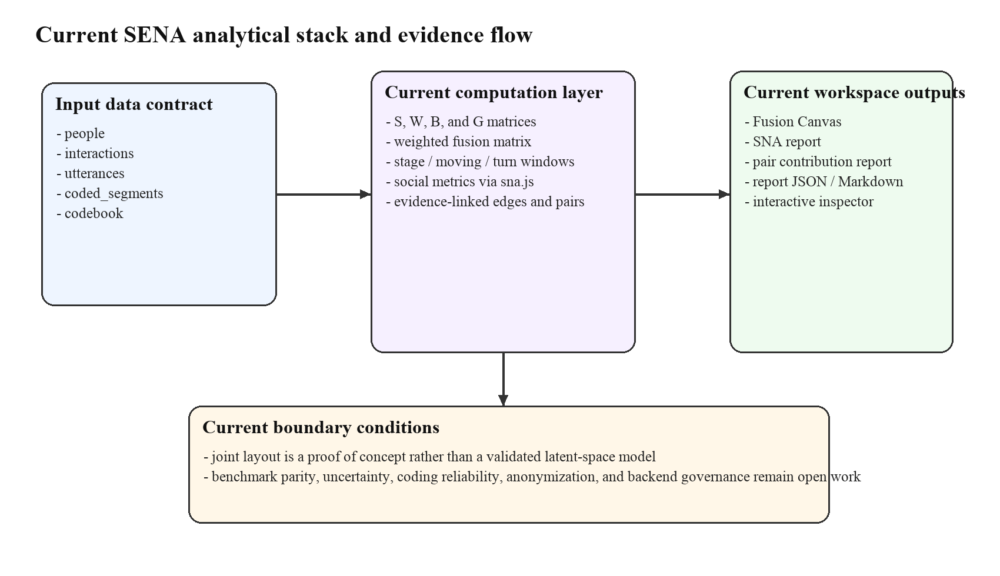
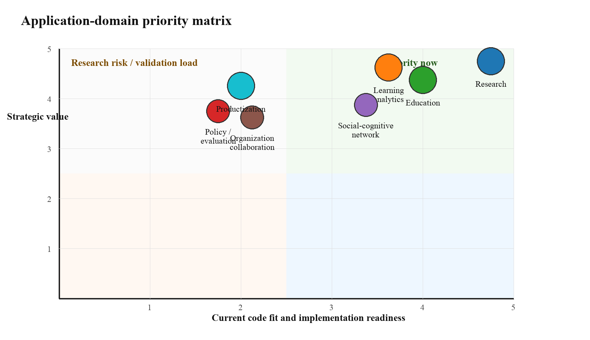

# SENA 应用领域深度分析报告

本报告基于当前 SENA 项目代码、现有页面文案、项目记忆与仓库内分析文档撰写，重点回答一个实际问题：**以当前代码基线看，SENA 最适合先落在哪些应用领域，为什么，下一步要补什么，哪些场景应当谨慎后置。**

执行摘要先给出结论。第一，SENA 当前最强的应用锚点仍然是**研究型协作学习分析**，因为它已经具备清晰的数据契约、可计算的社会层与认识论层、桥接矩阵、时间窗、证据回溯与基础报告导出。第二，最值得作为近期产品化试点的场景是**教育改进与学习分析**，尤其是 lesson study、教师协作、知识建构课堂和课程团队复盘。第三，**组织协作、政策/评估与广义 SaaS 产品化**并非没有价值，而是它们对数据治理、匿名化、统计稳健性、访问控制与部署架构的要求显著高于当前 MVP。

如 Table 1 所示，当前仓库已经把 SENA 从概念草图推进到了一个可运行的 fusion workspace：项目支持 `people`、`interactions`、`utterances`、`coded_segments`、`codebook` 五张核心表，能构造 `S`、`W`、`B`、`G` 与 weighted fusion matrix，并生成社会指标、时序窗口、证据链接与 JSON/Markdown 报告。这意味着 SENA 已经能够服务“带有明确语料、明确编码框架、明确分析单位”的应用；它最不适合的则是“没有可解释编码框架、没有隐私治理、希望直接自动化结论生成”的场景。

**Table 1**

*Current SENA capability-to-application map*

| 能力模块 | 当前项目依据 | 对应用范围的含义 |
|---|---|---|
| 数据契约与导入 | 当前 workspace 支持 `people`、`interactions`、`utterances`、`coded_segments`、`codebook` 五表结构，并带有列名自动映射与导入警告。 | 适合有明确定义数据表、可追溯说话轮次与编码段的数据集；不适合完全无结构日志直接入模。 |
| 核心矩阵 | 已实现 `S`、`W`、`B`、`G` 和 fusion matrix。 | 能同时回答“谁和谁互动”“哪些概念共同激活”“谁推动了哪些概念与 code-pair 连接”。 |
| 社会层分析 | 项目记忆与当前代码共同表明，系统已覆盖 density、tie count、components、average path length、degree、strength、closeness、reachable nodes，并在 workspace 报告层进一步呈现 reciprocity、betweenness 与 deterministic community detection。 | 对教师协作、学习参与角色、组织协作角色识别很有价值。 |
| 时序分析 | 已支持 stage、moving-window、turn-window 三类 temporal windows。 | 适合研究协作过程演化、课程阶段变化、干预前后变化与活动设计节奏。 |
| 证据追溯 | 边、pair contribution 与 temporal window 都能回连原始 utterance / segment evidence。 | 有利于研究解释、教师复盘与 human-reviewed reporting，不适合“黑箱评分”。 |
| 导出与报告 | 当前可导出 model JSON、social report、G report、report JSON/Markdown。 | 已具备研究与内部试点的报告基础，但尚未内建 publication-ready Word/PDF pipeline。 |
| 解释护栏 | workspace 明确声明 cross-layer distance 在 explanatory / ENA-space 模式下不应当被解释为严格统计距离，joint mode 只是 shared embedding proof of concept。 | 适合作为 exploratory / interpretive analytics；若要做高风险决策，仍需补正式 joint embedding 与统计验证。 |
| 平台缺口 | README 与伦理区块都指出：后端、身份认证、匿名化、审计日志、AI coding transparency、访问控制、正式 benchmark parity 仍待建设。 | 说明当前更适合 pilot、研究与小范围教学改进，而非直接机构级治理或商业化规模部署。 |

如 Figure 1 所示，当前 SENA 的逻辑已经非常清楚：输入层是五张结构化数据表，中间层是 `S/W/B/G + fusion` 的计算与时序切片，输出层是 Fusion Canvas、SNA 指标、pair contribution、temporal trace 与 report export。与此同时，底部还保留了一个清晰但尚未完全补齐的“边界条件层”，包括 benchmark parity、uncertainty、coding reliability、anonymization 与 backend governance。

**Figure 1**

*Current SENA analytical stack and evidence flow*

*Note.* The figure summarizes the current project state inferred from the SENA workspace code, README, project memory, and feasibility notes.

## 1. 研究场景

**价值：** 研究场景是当前 SENA 与代码基线最吻合的应用领域。项目已经围绕协作互动、话语转录、coded segments、codebook 与 temporal windows 组织数据结构，这与 ENA 对 coded connection 的要求高度一致，也与将社会关系和认识论关系并置分析的方向一致 (Shaffer et al., 2016; Gašević et al., 2019; Swiecki & Shaffer, 2020)。  
**典型使用情境：** CSCL 研究、课程设计研究、跨组比较、干预前后比较、同一团队在 brainstorming → evidence building → reflection 各阶段的变化研究。项目中 `ResearchCases.tsx` 已经公开展示了 MOOC collaborative learning、knowledge building、teacher scaffolding 与 deep learning representation 等案例方向。  
**数据需求：** 至少需要可识别参与者、互动关系、话轮文本、编码段与 codebook；若要做稳健时间分析，还应保留 stage、turn index、unit/stanza 与 outcome metadata。  
**方法适配性：** 当前 `S/W/B/G` 结构特别适合研究“谁推动了哪些概念连接”而不仅是“谁最活跃”或“哪些 code 最常共现”。`G` 矩阵让研究者能把个体贡献与 code-pair activation 对接起来，这是普通 SNA 或普通 ENA 各自做不到的。  
**潜在限制：** 目前 joint layout 仍是 POC；group comparison、significance、uncertainty、benchmark parity 和 coding reliability 还没有形成正式研究工作流。  
**伦理/隐私风险：** 研究场景通常涉及课堂对话、论坛帖子、身份与成绩信息，必须把“可视化方便”与“参与者可识别风险”分开处理；系统当前也还没有正式匿名化与审计日志模块。  
**实施路线：** 近期应优先把研究场景作为 SENA 的第一落地面：补 CSV/JSON 上传模板文档、codebook 模板、human review fields、publication-ready figure export、benchmark notes 与 dataset manifest。  
**优先级建议：** 最高优先级（Tier 1）。这是最能直接验证 SENA 理论主张、也最能基于现有代码快速形成高质量案例的领域。

## 2. 教育场景

**价值：** 教育场景与研究场景高度相邻，但目标更偏向 formative improvement，而不是正式发表。当前项目公开页面已经把 interdisciplinary lesson study、teacher collaboration、knowledge building 和 teacher scaffolding 视为直接应用方向，这说明产品叙事与方法设计本身已经在面向教育使用者。  
**典型使用情境：** lesson study 团队复盘、教师专业发展工作坊、课堂协作任务回顾、学生小组讨论质量反馈、知识建构课程的阶段性诊断。Pantić et al. (2022) 表明 social and epistemic network analysis 对教师 agency for change 的理解具有解释力，这与 SENA 的桥接层定位相符。  
**数据需求：** 除基础五表外，还需要课程阶段、任务类型、角色标签、班级/小组信息，以及可供教师理解的 outcome anchors，例如 rubric、artifact quality 或 reflection notes。  
**方法适配性：** 当前系统的 stage windows、evidence-linked inspector 和 pair contribution 报告非常适合做“这一阶段谁在推动 evidence-explanation-critique 的连接”“教师支架是否改变了讨论结构”这类问题。Ouyang and Dai (2022) 所提出的 three-layered social-cognitive network analysis 也说明教育场景重视社会参与角色、认知结构与时间变化的同时解释。  
**潜在限制：** 若教育使用者期待“一键评分”或“自动判定谁表现差”，当前方法并不适合；它更适合教师引导型解释，而非直接替代专业判断。  
**伦理/隐私风险：** 教室场景往往同时涉及未成年人、成绩、课堂摄录、敏感互动关系。若把 centrality 或 discourse quality 直接用于评价个体，容易造成标签化与误用。  
**实施路线：** 先做教师/课程团队专用 pilot：增加课程模板、角色模板、阶段标签模板、可打印报告与更友好的“evidence snippets + reflective prompts”页面。  
**优先级建议：** 最高优先级（Tier 1）。它比正式研究更容易形成试点，也最能体现 SENA 对教学设计和教师复盘的直接价值。

## 3. 组织协作场景

**价值：** 组织协作场景可以把 SENA 从教育研究方法扩展为知识工作分析工具，用于理解团队讨论如何把角色关系、任务协调与问题解决连接起来。理论上，这与 multilayer network 和 heterogeneous network 的思路一致 (Kivelä et al., 2014)。  
**典型使用情境：** 研究团队会议、跨部门项目复盘、产品评审会、政策工作组协商记录、医院或学校的跨专业协作会议分析。  
**数据需求：** 基础五表仍然成立，但组织场景对 interaction extraction 与 coding schema 的要求更高，因为 Slack、email、meeting transcript 与 issue tracker 数据并不会天然落在当前 SENA contract 上。  
**方法适配性：** 如果组织已愿意使用明确的 discourse codebook，例如 decision making、evidence use、risk escalation、handoff、coordination，那么当前 B/G 结构就很有价值，能够揭示“谁在推动哪类知识连接与组织协调”。  
**潜在限制：** 当前项目没有企业身份权限、保留策略、细粒度审计、批处理管线，也没有专门针对异步沟通数据的 ingestion layer。  
**伦理/隐私风险：** 这是高风险场景。组织沟通数据包含绩效、权力关系、敏感业务信息与员工画像风险。如果没有 consent、purpose limitation 与 access control，SENA 很容易从协作改进工具滑向监控工具。  
**实施路线：** 该场景不应作为第一批公开产品目标，而应在研究/教育 pilot 稳定后，通过小范围合作项目验证。需要先补 anonymization、RBAC、审计日志、组织级 codebook governance 与 secure backend。  
**优先级建议：** 中等优先级（Tier 2）。价值大，但治理成本显著高于当前代码准备度。

## 4. 学习分析场景

**价值：** 学习分析是当前项目最值得加速靠近的场景之一，因为 SENA 天然可以充当“把 social participation 与 epistemic engagement 放在同一个解释框架里”的 dashboard engine，而不是只报点击量或发帖量。SENS、iSENS 与 SeNA 都在不同程度上说明将 social 与 epistemic 维度结合，有助于更有信息量地理解学习过程 (Gašević et al., 2019; Swiecki & Shaffer, 2020; Yan et al., 2023)。  
**典型使用情境：** 课程仪表板、MOOC 论坛过程监控、项目制学习小组比较、教练或教学助理的 formative intervention dashboard。  
**数据需求：** 除标准五表外，learning analytics 场景通常还需要 course roster、time stamps、assignment metadata、outcome linkage、dashboard access roles 与 intervention logs。  
**方法适配性：** 当前 temporal window builder、social metrics panel 与 report generator 已经具备 dashboard 核心骨架。对于“哪些小组虽然互动多，但证据-解释连接弱”“谁虽然不是最 central，但在关键 code-pair 上有高贡献”这类问题，SENA 比传统 activity analytics 更强。  
**潜在限制：** 目前缺少 near-real-time backend、batch jobs、dashboard persistence、institutional authentication 与 cross-course model governance。  
**伦理/隐私风险：** 学习分析一旦接近实时干预，就会放大 consent、student agency、model opacity 与 data minimization 问题。Slade and Prinsloo (2013) 与 Drachsler and Greller (2016) 都提醒我们，学习分析不能默认把“能算”当作“该用”。  
**实施路线：** 应把学习分析定位为 Tier 1.5 场景：先从课程团队内部 dashboard 与 weekly review report 起步，而不是做实时学生监控。技术上优先补 authentication、saved analyses、result snapshots、teacher-facing guidance 与 governance checklist。  
**优先级建议：** 高优先级（Tier 1），但应先做 instructor-facing pilot，而非 student-facing automated intervention system。

## 5. 社会-认知网络分析场景

**价值：** 这是最能体现 SENA 方法学独特性的领域。与其把它看作一个单独行业，不如把它看作 SENA 的“方法实验室”场景：研究者可以用它比较 SNA、ENA、SENS、iSENS、SeNA、SCNA 与多层网络表征的差异。  
**典型使用情境：** 方法论文、比较研究、grant proposal 中的方法演示、跨研究团队的 shared analytic workbench。  
**数据需求：** 与研究场景类似，但更强调可重复的数据清单、参数日志、normalization 记录、window rules、benchmark notes 与 versioned codebooks。  
**方法适配性：** 当前项目已经把“joint mode 只是 proof of concept”“cross-layer distance 不可随意解释”明确写进 workspace guardrail，这反而为方法学场景加分，因为它表明项目没有把 exploratory visualization 伪装成完成的统计模型。Bowman et al. (2021) 对 ENA 数学基础的澄清，也支持把 SENA 明确表述为 fusion adjacency representation，而不是直接声称自己已经完成传统 ENA 的全部统计解释。  
**潜在限制：** 目前还没有 formal uncertainty estimates、permutation testing、comparison workflow、stability diagnostics 与 richer benchmark suite。  
**伦理/隐私风险：** 相对较低，但如果用真实课堂或组织数据做方法演示，仍须遵守最小化披露与匿名化原则。  
**实施路线：** 将这一场景与研究场景并行推进：保留它作为 grant writing、conference demo 与 methodological validation 的核心阵地。  
**优先级建议：** 中高优先级（Tier 2）。它不是最先变现的场景，却是最重要的学术护城河。

## 6. 政策与评估场景

**价值：** 政策/评估场景关注的不是单个团队的对话，而是项目、课程、计划或机构层面的比较与证据汇总。理论上，SENA 可以为项目评估提供比传统问卷更细的过程证据。  
**典型使用情境：** 教改项目评估、教师发展计划评估、跨校协作项目评估、政策试点中的过程性证据采集。  
**数据需求：** 在五表之外，需要 cohort comparability、sampling rules、intervention metadata、outcome linkage、aggregation rules、uncertainty and confidence documentation。  
**方法适配性：** SENA 很适合做过程性解释层，帮助评估者说明某项政策或干预是否改变了参与结构、证据使用、反思深度与协作桥接方式。  
**潜在限制：** 当前代码还不具备机构级 aggregation、case comparison pipeline、governance dashboard、approval workflow 与 statistical reporting robustness。没有这些支撑时，把 exploratory network evidence 直接上升为政策判断是过早的。  
**伦理/隐私风险：** 高。政策与评估场景容易把群体层分析向个体追责滑移；同时跨项目数据整合会显著放大去标识化失败风险。  
**实施路线：** 该场景应当晚于研究、教育和教师/课程 learning analytics 试点。先把 SENA 作为“evaluation companion tool”，而不是“policy score engine”。  
**优先级建议：** 中低优先级（Tier 3）。长期重要，但当前方法与治理成熟度都不足以支撑大规模评估决策。

## 7. 产品化场景

**价值：** 产品化不是单一应用领域，而是前述领域能否被稳定封装、部署与持续服务的综合结果。SENA 作为产品的潜力，在于它不是一般的 network visualization，而是把 social structure、epistemic structure、bridge contribution、temporal change 和 evidence review 串成一个工作台。  
**典型使用情境：** 研究团队 SaaS、机构内分析门户、课程团队订阅式 dashboard、方法咨询与报告服务平台。  
**数据需求：** 除分析数据本身，还需要 tenants、permissions、saved projects、job queues、audit logs、secure storage、API contracts、report templates 与 admin tooling。  
**方法适配性：** 当前前端与本地分析逻辑已经证明交互式产品体验可以成立；README 也明确指出后续应补身份认证、上传、报告、日志与后端服务。换句话说，产品化在架构上是 plausible 的，但还不是 deployment-ready。  
**潜在限制：** 现在的项目仍然更像 high-quality MVP / research platform template，而不是 production SaaS。没有 backend orchestration、observability、privacy-by-design pipeline、billing/tenant model，就不能把“可演示”误判为“可交付”。  
**伦理/隐私风险：** 产品化会把所有前述风险放大，因为 scale 会带来更多数据、更复杂权限与更多误用机会。  
**实施路线：** 产品化应被拆成三个阶段：先做 research/education pilot package，再做 institution-facing secure deployment，再考虑 generalized SaaS。  
**优先级建议：** 条件性优先级（Tier 3）。它在商业上可能重要，但从当前项目成熟度看，不应早于研究、教育和 instructor-facing learning analytics。

## 8. 跨领域方法与治理要求

跨领域看，SENA 最关键的数据要求并不是“数据多”，而是“数据结构清楚、编码框架清楚、证据链清楚”。当前项目的数据契约已经很好地定义了这一点，因此近期最值得坚持的策略不是盲目扩张数据源，而是维持 contract discipline：谁是 actor，什么是 interaction，哪一段文本被赋予了哪些 code，时间窗如何定义，哪些结论必须回连原始证据。

同样重要的是治理要求。当前页面的 ethics section 已经把 anonymization、role-based access control、consent/IRB metadata、audit logs、AI coding transparency、bias warnings、reproducibility exports 与 human review 列为可信使用前提。这些并不是“以后再说的锦上添花”，而是决定 SENA 能否进入 learning analytics、organization collaboration 与 policy/evaluation 场景的硬门槛。

## 9. 优先级与实施路线

Table 2 总结了基于当前代码基线而非抽象愿景所做的优先级判断。这里的 `当前代码适配度` 反映现有功能与该场景的贴合程度，`战略价值` 反映其长期影响与代表性，`实施/治理负担` 越高表示越不应过早推进。

**Table 2**

*Application-domain priority summary*

| 应用领域 | 当前代码适配度 (1-5) | 战略价值 (1-5) | 实施/治理负担 (1-5) | 建议优先级 |
|---|---:|---:|---:|---|
| 研究 | 5.0 | 5.0 | 2.0 | Tier 1 |
| 教育 | 4.0 | 5.0 | 2.0 | Tier 1 |
| 学习分析 | 4.0 | 5.0 | 3.0 | Tier 1 |
| 社会-认知网络分析 | 4.0 | 4.0 | 3.0 | Tier 2 |
| 组织协作 | 3.0 | 4.0 | 4.0 | Tier 2 |
| 政策/评估 | 2.0 | 4.0 | 5.0 | Tier 3 |
| 产品化 | 3.0 | 4.0 | 5.0 | Tier 3 |

*Note.* Higher implementation/governance load indicates stronger reasons to delay full-scale rollout even when strategic value is high.

Figure 2 把同样的判断放在一个二维矩阵里。右上象限是应该先投入的方向，左上象限是价值高但治理或验证成本过大的方向，右下象限则通常意味着“技术上能做，但不是当前最值得优先的机会”。

**Figure 2**

*Application-domain priority matrix*

*Note.* Positions are analytic judgments grounded in the current SENA codebase and project documents, not empirical product-market-fit measurements.

**Table 3**

*Recommended phased implementation roadmap*

| 阶段 | 核心目标 | 需要补充的能力 | 代表性交付物 |
|---|---|---|---|
| 0-3 个月 | 夯实研究与教育 pilot | 上传模板、codebook templates、publication-ready exports、benchmark notes、human review workflow | 2-3 个高质量研究/课程试点案例与标准报告模板 |
| 3-6 个月 | 做 instructor-facing learning analytics | 身份认证、saved analyses、result snapshots、teacher guidance、governance checklist | 课程团队 dashboard 与周期性复盘报告 |
| 6-12 个月 | 谨慎扩展到组织协作与机构部署 | anonymization pipeline、RBAC、audit logs、secure backend、batch jobs、API contracts | 受控机构试点、项目级评估伴随工具 |

综合来看，当前 SENA 最应该坚持的不是“功能越多越好”，而是“应用场景与方法成熟度严格匹配”。如果项目把研究、教育与 instructor-facing learning analytics 做深，SENA 将同时获得理论可信度、产品可解释性与真实使用反馈；如果过早冲向组织监控、政策评分或通用 SaaS，当前代码与治理基础都还不足以支撑。

因此，本报告的最终建议是：

1. 把**研究 + 教育 + instructor-facing learning analytics**作为近期主航道。
2. 把**社会-认知网络方法验证**作为学术护城河，持续补 benchmark、uncertainty 与 comparison workflow。
3. 把**组织协作、政策/评估与广义产品化**放在治理与后端能力补齐之后，再进入正式规模化推进。

## References

Bowman, N. A., Frank, K. A., & Shaffer, D. W. (2021). The mathematical foundations of epistemic network analysis. In D. Williamson Shaffer (Ed.), *Computer-supported collaboration with epistemic network analysis* (pp. 91-108). Springer. https://doi.org/10.1007/978-3-030-67788-6_7

Drachsler, H., & Greller, W. (2016). Privacy and analytics: It’s a DELICATE issue. In *Proceedings of the Sixth International Conference on Learning Analytics & Knowledge* (pp. 89-98). ACM. https://doi.org/10.1145/2883851.2883893

Gašević, D., Joksimović, S., Eagan, B. R., & Shaffer, D. W. (2019). SENS: Network analytics to combine social and cognitive perspectives of collaborative learning. *Computers in Human Behavior, 92*, 562-577. https://doi.org/10.1016/j.chb.2018.07.003

Kivelä, M., Arenas, A., Barthelemy, M., Gleeson, J. P., Moreno, Y., & Porter, M. A. (2014). Multilayer networks. *Journal of Complex Networks, 2*(3), 203-271. https://doi.org/10.1093/comnet/cnu016

Ouyang, F., & Dai, X. (2022). A three-layered social-cognitive network analysis framework for examining online collaborative learning. *Australasian Journal of Educational Technology, 38*(5), 74-91. https://doi.org/10.14742/ajet.7166

Pantić, N., Brown, C., Florian, L., & Jääskeläinen, A. (2022). Making sense of teacher agency for change with social and epistemic network analysis. *Journal of Educational Change, 23*, 717-739. https://doi.org/10.1007/s10833-021-09413-7

Shaffer, D. W., Collier, W., & Ruis, A. R. (2016). A tutorial on epistemic network analysis: Analyzing the structure of connections in cognitive, social, and interaction data. *Journal of Learning Analytics, 3*(3), 9-45. https://doi.org/10.18608/jla.2016.33.3

Siebert-Evenstone, A. L., Irgens, G. A., Collier, W., Swiecki, Z., Ruis, A. R., & Shaffer, D. W. (2017). In search of conversational grain size: Modeling semantic structure using moving stanza windows. *Journal of Learning Analytics, 4*(3), 123-139. https://doi.org/10.18608/jla.2017.43.7

Slade, S., & Prinsloo, P. (2013). Learning analytics: Ethical issues and dilemmas. *American Behavioral Scientist, 57*(10), 1510-1529. https://doi.org/10.1177/0002764213479366

Swiecki, Z., & Shaffer, D. W. (2020). iSENS: An integrated approach to combining epistemic and social network analyses. In *Proceedings of the Tenth International Conference on Learning Analytics & Knowledge* (pp. 177-181). ACM. https://doi.org/10.1145/3375462.3375505

Yan, L., Martinez-Maldonado, R., Zhao, Y., Li, X., & Gašević, D. (2023). SeNA: Modelling socio-spatial analytics on homophily by integrating social and epistemic network analysis. In *Proceedings of the 13th International Learning Analytics and Knowledge Conference* (pp. 455-466). ACM. https://doi.org/10.1145/3576050.3576054
